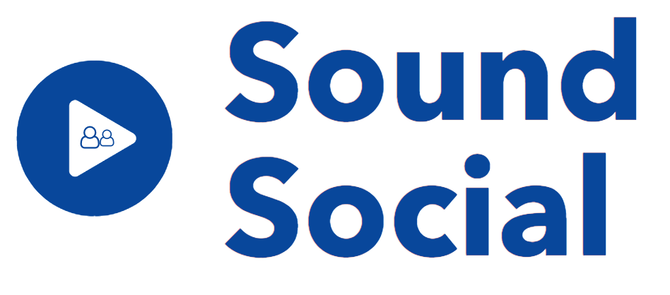

# 

**The open and social music platform.**

> Early work in progress

This platform is here to form new connections with artists, creatives and passionate listeners. No matter if it's a tiny drum loop, professional podcast or an unfinished track, Sounds Social provides a way to **share your sound** usefully. 

## Contact

* [Mastodon](https://mastodon.social/@matteodem)
* [Personal website](http://matteodem.ch/)

## Docs

Docs for the project can be found [here](./docs).

## Support

You can play around on the [dev environment](https://sounds-social-dev.surge.sh/), have a look at the open [issues](https://github.com/matteodem/sounds-social/issues) or read through the [docs](/docs).

Right now I'm doing this in my free time, so any support is greatly appreciated.

* Bitcoin `3C1YHxxD1YhbSVZetttTHLQ2YJxR9tPgTY`
* Ethereum `0xe9452B8d109248b5Da4A1F2d91802cfBE43534EB`
* PayPal [https://www.paypal.me/matteodem](https://www.paypal.me/matteodem)
